# Задание 1

1. Открываю https://en.wikipedia.org/wiki/HTTP
2. Обращаю внимание на разделы, связанные с запросами:

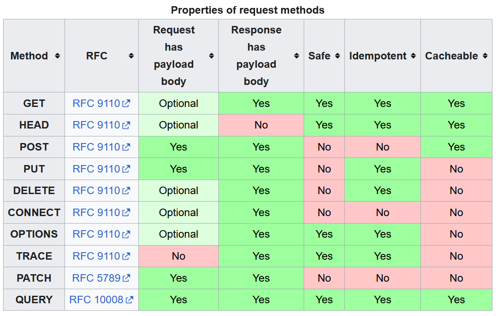

3-5.

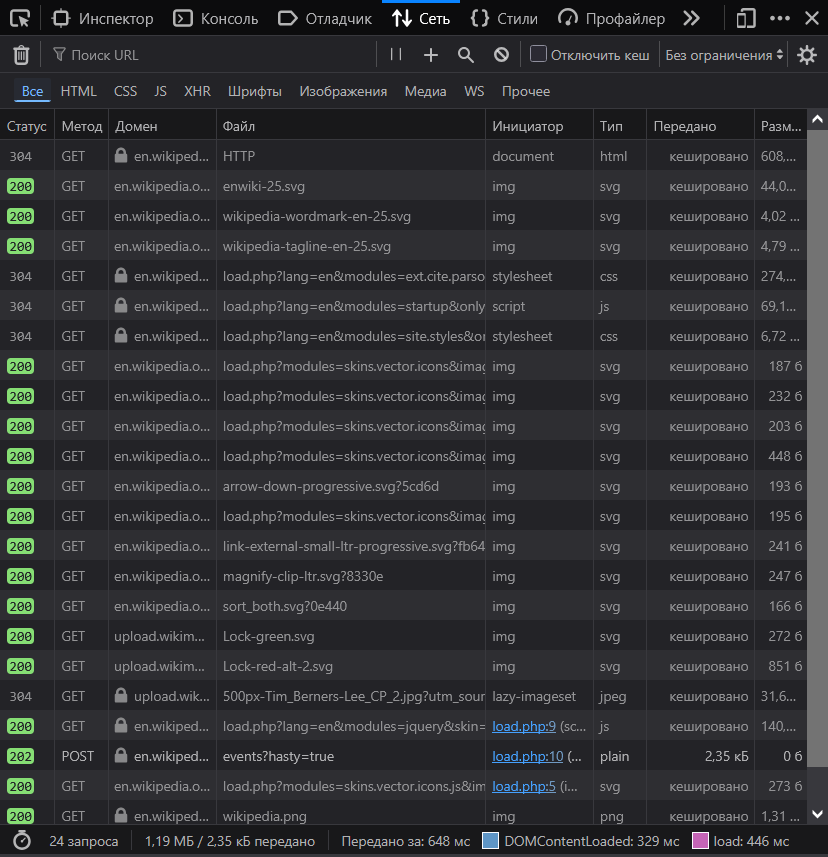

6. Открываем первый запрос и изучаю:

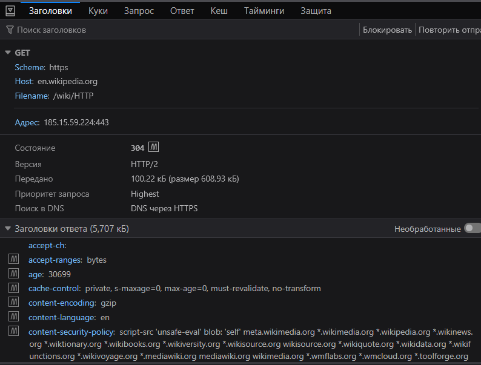

* **URL запроса** — `https://en.wikipedia.org/wiki/HTTP`
* **Метод запроса** — `GET`. Используется именно этот, потому что мы хотим получить страницу Википедии от сервера.
* **Статус ответа** — `304 Not Modified`. Означает, что запрошенный ресурс не изменился с последнего запроса, поэтому сервер разрешает использовать закешированную у клиента версию вместо повторной передачи данных. [source](https://developer.mozilla.org/en-US/docs/Web/HTTP/Reference/Status/304?utm_source=devtools&utm_medium=devtools-netmonitor&utm_campaign=default)

> **P.S.** Если перезагрузить страницу с помощью <kbd>Ctrl</kbd> + <kbd>Shift</kbd> + <kbd>R</kbd>, то статус ответа изменится на `200 OK`.

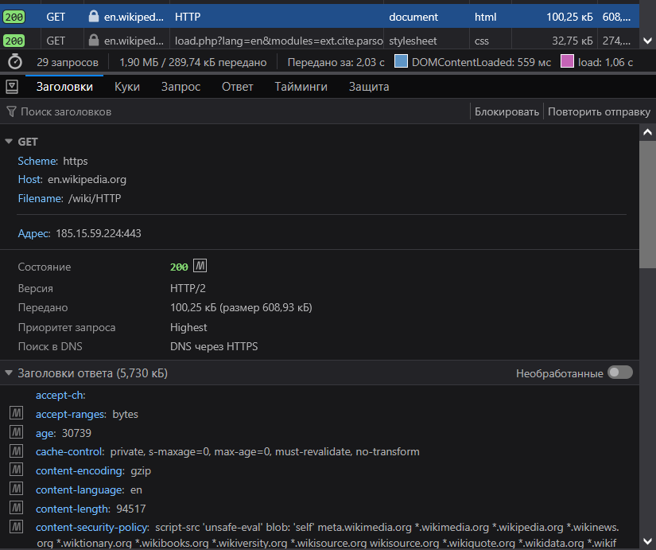

* **Заголовки запроса и ответа** — их много, так что перечислю только самое необходимое:

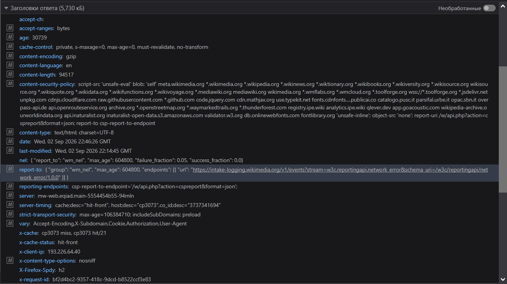
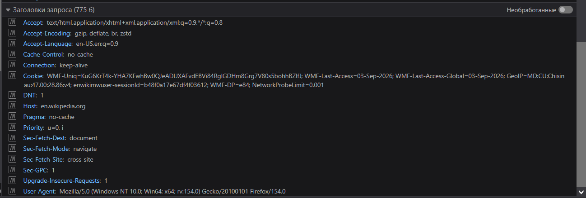

**Запрос:**
* `Accept*` — предпочтения браузера (формат, язык, кодировка)
* `Cache-Control` / `Pragma: no-cache` — не использовать кеш без проверки
* `Cookie` — данные сессии
* `Host` — домен назначения
* `User-Agent` — браузер/ОС
* `Sec-Fetch-*` — контекст запроса

**Ответ:**
* `Cache-Control` — правила кеширования
* `Content-Type` / `Length` / `Encoding` — тип, размер, сжатие контента
* `Last-Modified` — дата изменения ресурса
* `Content-Security-Policy` — разрешённые источники скриптов
* `Server` — ПО сервера
* `X-Cache(-Status)` — попал ли ответ из кеша (hit/miss)
* `Strict-Transport-Security` — принудительный HTTPS

* **Есть ли тело запроса или ответа:** тело запроса пустое, а тело ответа — это HTML-разметка страницы.

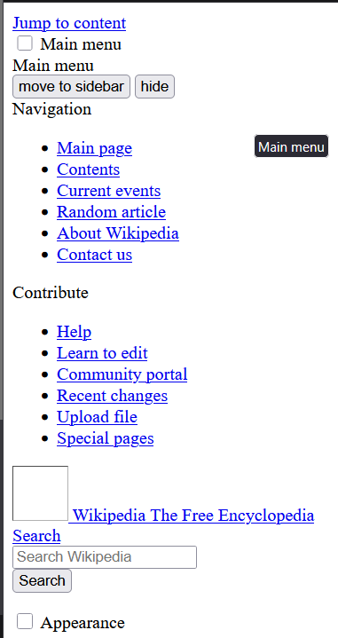

7. **Какие еще запросы были отправлены при загрузке страницы и почему?**  
Ещё были отправлены GET-запросы на получение картинок, стилей и скриптов, и один POST телеметрии.

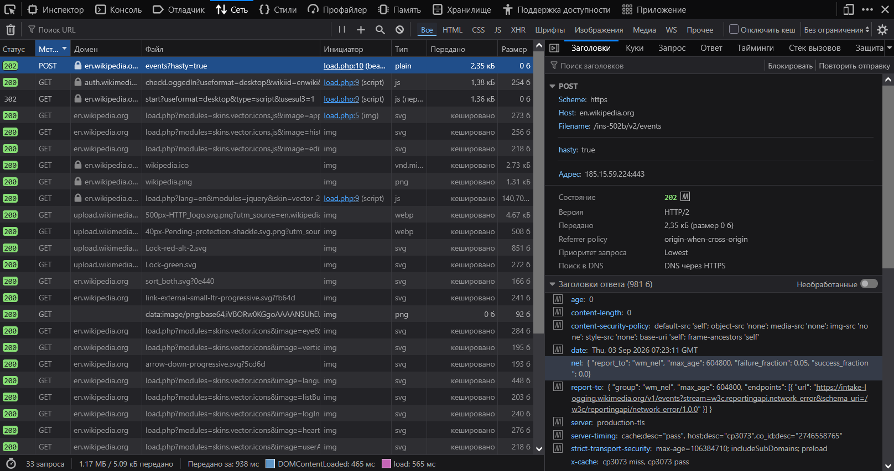

8. Готово
9. При переходе на `https://en.wikipedia.org/wiki/HTTPdsfdfs` получил ответ с кодом ошибки `404 Не найдено`

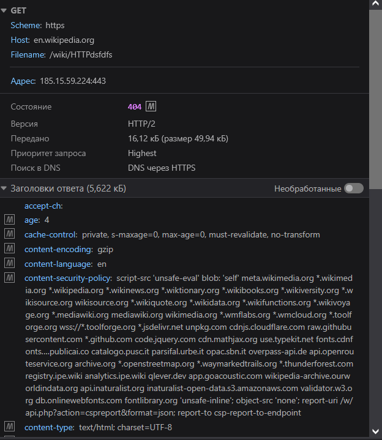

# Задание 2

1. Перешёл на https://en.wikipedia.org/wiki/Special:Search
2. Выполнил поиск "browser"
3. Зашёл в Network 
4. При вводе слова предложило автодополнение:

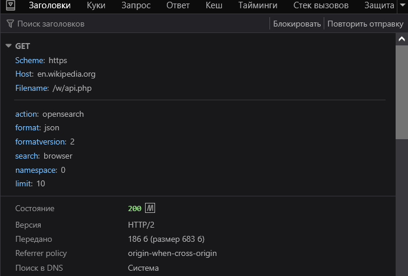

Сам поиск использует метод `GET`, потому что он отправляет запрос с поисковым запросом.

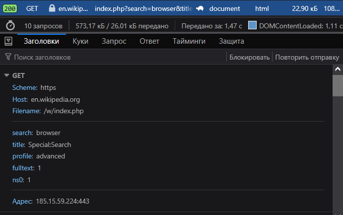

**Какие параметры:**
```http
GET /w/index.php?search=browser&title=Special%3ASearch&profile=advanced&fulltext=1&ns0=1
```
* `search` — поисковый запрос
* `profile` — профиль поиска
* `fulltext` — включить поиск по полному тексту
* `ns0` — включить поиск в пространстве имён

# Задание 3

1. Анализирую HTTP-запрос для `www.google.com`:

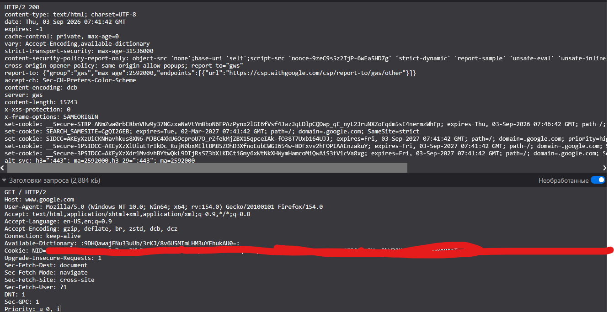

**Заголовки запроса:**
* `Host`, `User-Agent`, `Accept*` — стандартные данные о браузере и предпочтениях
* `Accept-Encoding: ...dcb, dcz` — помимо обычных методов сжатия, поддерживается Compression Dictionary Transport (`dcb`/`dcz` — сжатие с использованием словаря)
* `Available-Dictionary` — хэш ранее сохранённого словаря сжатия, который браузер может использовать повторно (экономия трафика)
* `Cookie` — закрашено (скрыты приватные данные), содержит `NID` и другие
* `Sec-Fetch-*` — навигационный запрос документа, cross-site
* `DNT`, `Sec-GPC` — сигналы "не отслеживать"
* `Priority: u=0, i` — высокий приоритет (главный документ)

**Заголовки ответа:**
* `HTTP/2 200` — успешный ответ
* `content-type: text/html; charset=UTF-8`
* `expires: -1` / `cache-control: private, max-age=0` — страница не кешируется
* `strict-transport-security` — принудительный HTTPS (HSTS)
* `content-security-policy-report-only` — CSP в тестовом режиме (только логирует нарушения, не блокирует)
* `cross-origin-opener-policy: same-origin-allow-popups` — изоляция от чужих окон/вкладок
* `report-to` — эндпоинт для отчётов об ошибках (`csp.withgoogle.com`)
* `accept-ch: Sec-CH-Prefers-Color-Scheme` — сервер запрашивает Client Hint о цветовой теме браузера
* `content-encoding: dcb` — тело сжато с использованием словаря (см. `Available-Dictionary` из запроса)
* `server: gws` — Google Web Server
* `x-frame-options: SAMEORIGIN` — запрет встраивания страницы в чужой iframe
* `x-xss-protection: 0` — встроенная защита от XSS в браузере отключена (доверие CSP вместо неё)
* `set-cookie` (несколько) — установка cookies для аутентификации/трекинга (`__Secure-STRP`, `SEARCH_SAMESITE`, `SIDCC`, `__Secure-1PSIDCC`, `__Secure-3PSIDCC` и др.), у большинства `SameSite=strict` или ограничение по домену `.google.com`
* `alt-svc: h3=":443"...` — сервер сообщает о доступности HTTP/3 (QUIC) для последующих соединений

# Задание 4

1. Запрос к http://sandbox.usm.com, указав в заголовке `User-Agent` ваше имя и фамилию:
```bash
curl -H "User-Agent: Domnici Constantin" http://sandbox.usm.com
```
`User-Agent` — это заголовок HTTP-запроса, который сообщает серверу информацию о браузере, операционной системе и другой информации о клиенте, отправившем запрос.

2. Составьте POST-запрос к серверу по адресу http://sandbox.usm.com/cars, указав в теле запроса следующие параметры:
```bash
curl -X POST http://sandbox.usm.com/cars \
  -H "Content-Type: application/json" \
  -d '{"make": "Toyota", "model": "Corolla", "year": 2020}'
```

**Какие еще методы HTTP-запросов существуют и для чего они используются?**

Существуют следующие методы HTTP-запросов:
* `GET` — получение данных с сервера
* `POST` — отправка данных на сервер
* `PUT` — обновление данных на сервере
* `DELETE` — удаление данных с сервера
* `HEAD` — получение заголовков ответа без тела
* `OPTIONS` — получение списка разрешенных методов
* `TRACE` — получение трассировки запроса

3. Составьте PUT-запрос к серверу по адресу http://sandbox.usm.com/cars/1, указав в заголовке `User-Agent` ваше имя и фамилию, в заголовке `Content-Type` значение `application/json` и в теле запроса следующие параметры:

```json
{
  "make": "Toyota",
  "model": "Corolla",
  "year": 2021
}
```

```bash
curl -X PUT http://sandbox.usm.com/cars/1 \
  -H "User-Agent: Domnici Constantin" \
  -H "Content-Type: application/json" \
  -d '{"make": "Toyota", "model": "Corolla", "year": 2021}'
```

**Отличие PATCH и PUT:**
* `PATCH` — частичное обновление ресурса
* `PUT` — полное обновление ресурса

4. Напишите один из возможных вариантов ответа сервера на следующий запрос:

```http
POST /cars HTTP/1.1
Host: sandbox.com
Content-Type: application/json
User-Agent: John Doe

model=Corolla&make=Toyota&year=2020
```

**Предположите ситуации, когда сервер на запрос выше может вернуть HTTP-коды состояния 200, 201, 400, 401, 403, 404, 500:**

#### 1. Код `200 OK`
* **Ситуация:** Сервер успешно обработал запрос, но вместо создания новой записи вернул подтверждение или обновил существующий ресурс (например, автомобиль с такими параметрами уже существует в базе данных, и система работает идемпотентно), либо API сконфигурировано возвращать `200 OK` с телом результата вместо `201`.
* **Пример ответа:**
```http
HTTP/1.1 200 OK
Content-Type: application/json

{
    "status": "success",
    "message": "Car already exists or processed successfully",
    "id": 42
}
```

#### 2. Код `201 Created`
* **Ситуация:** Ресурс успешно создан в базе данных. Сервер возвращает заголовок `Location` со ссылкой на созданный ресурс и данные объекта с присвоенным идентификатором `id`.
* **Пример ответа:**
```http
HTTP/1.1 201 Created
Content-Type: application/json
Location: /cars/42
Content-Length: 63

{
    "id": 42,
    "make": "Toyota",
    "model": "Corolla",
    "year": 2020
}
```

#### 3. Код `400 Bad Request`
* **Ситуация:** Некорректный синтаксис запроса со стороны клиента. В данном запросе указан заголовок `Content-Type: application/json`, однако тело передано в формате URL-encoded строки (`model=Corolla&make=Toyota&year=2020`), из-за чего JSON-парсер сервера вернёт синтаксическую ошибку. Также код возвращается, если отсутствуют обязательные поля или переданы некорректные типы данных (например, отрицательный год).
* **Пример ответа:**
```http
HTTP/1.1 400 Bad Request
Content-Type: application/json

{
    "error": "Bad Request",
    "message": "Invalid JSON format: request body does not match Content-Type application/json"
}
```

#### 4. Код `401 Unauthorized`
* **Ситуация:** Запрос требует аутентификации пользователя, однако заголовок `Authorization` в запросе отсутствует либо переданный токен/ключ недействителен или истёк. Сервер сообщает поддерживаемую схему аутентификации в заголовке `WWW-Authenticate`.
* **Пример ответа:**
```http
HTTP/1.1 401 Unauthorized
WWW-Authenticate: Bearer

{
    "error": "Authentication required"
}
```

#### 5. Код `403 Forbidden`
* **Ситуация:** Клиент успешно аутентифицирован (сервер знает личность пользователя), однако у его учётной записи недостаточно прав (ролей) для выполнения этой операции (например, у пользователя роль гостя/читателя, а добавлять машины разрешено только администраторам).
* **Пример ответа:**
```http
HTTP/1.1 403 Forbidden
Content-Type: application/json

{
    "error": "Forbidden",
    "message": "Access denied: insufficient permissions to create cars"
}
```

#### 6. Код `404 Not Found`
* **Ситуация:** Запрашиваемый эндпоинт `/cars` не существует на сервере (например, допущена ошибка в URL маршрута, либо сервис перешёл на другую схему адресации, например `/api/v1/cars`).
* **Пример ответа:**
```http
HTTP/1.1 404 Not Found
Content-Type: application/json

{
    "error": "Not Found",
    "message": "Endpoint /cars does not exist"
}
```

#### 7. Код `500 Internal Server Error`
* **Ситуация:** Непредвиденная внутренняя ошибка на стороне сервера при обработке запроса (например, потеря связи с базой данных, ошибка выполнения SQL-запроса или необработанное исключение в коде бэкенда).
* **Пример ответа:**
```http
HTTP/1.1 500 Internal Server Error
Content-Type: application/json

{
    "error": "Internal Server Error",
    "message": "An unexpected error occurred on the server"
}
```
