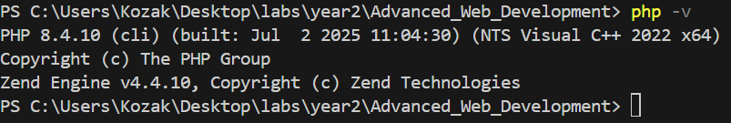
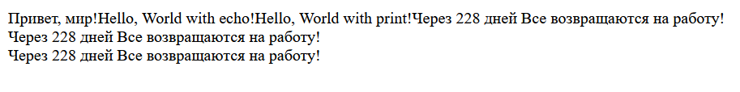

# Шаг 1-2 Установка PHP
Уже установлен так что пропускаем

# Шаг 3
Создайте файл [index.php](index.php) и запускаю
```cmd
PS C:\Users\Kozak\Desktop\labs\year2\Advanced_Web_Development> php lab2/index.php
Привет, мир!
```
# Шаг 4
Добавте в index.php 
```php
<?php
echo "Hello, World with echo!";
print "Hello, World with print!";
```
И запустите
```cmd
PS C:\Users\Kozak\Desktop\labs\year2\Advanced_Web_Development> php lab2/index.php
Привет, мир!Hello, World with echo!Hello, World with print!
```

# Шаг 5

Создайте две переменные:

    Целочисленную переменную $days со значением 288.
    Строковую переменную $message с текстом: Все возвращаются на работу!.

Выведите значения переменных на экран несколькими способами:

    С использованием конкатенации. Конкатенация - это объединение строк, в PHP используется оператор .:
    С использованием двойных кавычек.

Используйте переход на новую строку в выводе используя тэг <br />.

Запускаю через

```cmd
php -S localhost:8000 -t lab2
```

И переходу на `localhost:8000` в браузере.

Результат:



Способы установки PHP: PHP можно установить с помощью пакетов операционной системы (например, apt, yum или Homebrew), в составе готовых локальных серверов (XAMPP, Open Server) или развернув в Docker-контейнере.

Проверка установки и работы: Чтобы убедиться, что PHP установлен и работает, выполните команду php -v в терминале или запустите PHP-файл с функцией <?php phpinfo(); ?> через веб-сервер.

Отличие echo от print: echo работает немного быстрее, не возвращает значение и может принимать несколько аргументов через запятую, тогда как print всегда возвращает значение 1 и принимает только один аргумент.

Вывод: PHP легко устанавливается через локальные сборки или пакетные менеджеры, проверяется командой php -v, а его базовый вывод осуществляется с помощью echo (быстрее и без возвращаемого значения) или print (возвращает 1).